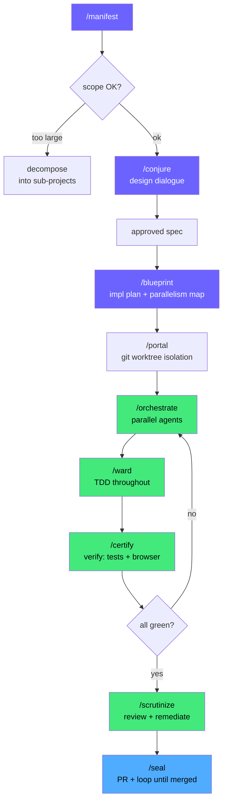
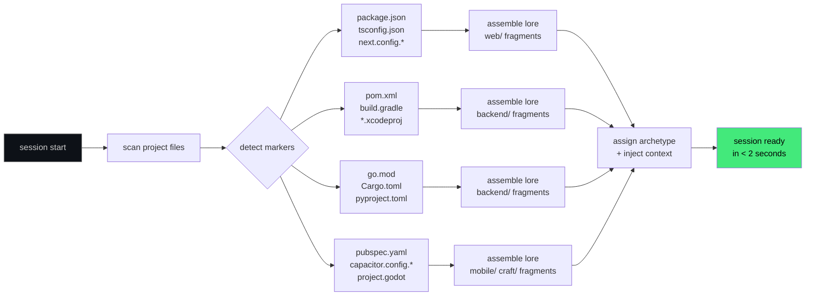
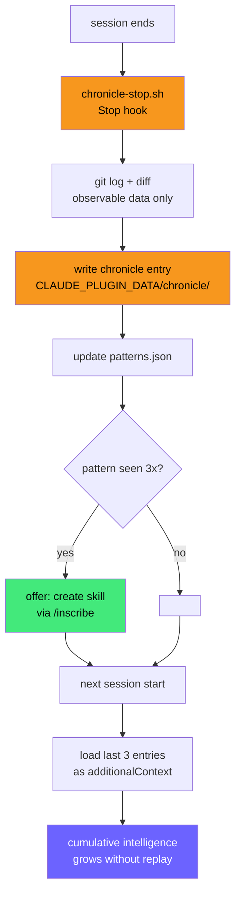

<div align="center">

```
       *       
      /|\      
     / | \     
    /  *  \    
   /_______\   
  /^  ^.^  ^\  
  \  ~(u)~  /  
   \_______/~  
     |   |  /  
```

# magician

**Full-stack SDLC plugin for Claude Code and Codex**

Inspects your project, assembles the right knowledge automatically, orchestrates parallel agents, learns from every session, and ships clean code — from idea to merged PR, autonomously.

[](https://github.com/Alexander-Tyagunov/magician/releases)
[](LICENSE)
[](https://github.com/sponsors/Alexander-Tyagunov)

</div>

---

## What it does

Most AI coding tools require you to describe your stack, pick templates, and manage context manually. Magician inspects your project on every session start, assembles targeted knowledge for every technology it finds, and gets smarter with every session.

One command to go from idea to PR:

```
/manifest
```

Working with something that already exists? Comprehend a feature — from its live usage, its codebase, its docs, or pure black-box — then **port** it into another app (optionally upgrading the vendor) or **integrate/transform** it in place (redesign · swap the 3rd-party behind it while preserving the UX · add a capability), behind a parity contract and quality gateways:

```
/transmute
```

---

## How it works

### The manifest flow — full autonomous SDLC



Human gates (4 only): scope confirm → spec approval → plan approval → PR title. Everything else: autonomous.

---

### Dynamic project inspector — no manual stack selection



Polyglot stacks (Next.js + FastAPI + Go) get full coverage automatically. No pack selection needed.

---

### Self-learning — intelligence grows each session



---

## Skills

25 skills. Each carries modern frontmatter (`allowed-tools` to cut permission prompts in auto mode, `disable-model-invocation` on side-effecting standalone skills, `argument-hint`, `context: fork` for heavy read-only work) and scales reasoning effort to the task.

| Skill | Purpose | Category |
|---|---|---|
| `/conjure` | Structured design dialogue with visual browser companion — 4 modes (Visual+Strict, Visual+Reference, Text-only, Design-Only); HARD-GATE: no code until spec approved. Reference material lives in `references/` (progressive disclosure) | Core SDLC |
| `/blueprint` | Converts an approved spec into a TDD task plan with parallelism map (PARALLEL vs SEQUENTIAL tasks) saved to `.workspace/shared/plans/` | Core SDLC |
| `/ward` | TDD engine — red→green→refactor, one behavior at a time. `/ward task <N>` executes a single blueprint task end-to-end (failing test → minimum impl → lint/type-check → full suite → commit → check off). *(merged the former `/forge`)* | Core SDLC |
| `/unravel` | Systematic debugging with mandatory hypothesis preflight — no code changes before evidence; one change at a time, then regression test | Core SDLC |
| `/certify` | Full verification loop — tests, types, lint, build, and Playwright browser check for UI projects; collects evidence before any success claim | Core SDLC |
| `/orchestrate` | Drives multi-agent implementation from a blueprint — groups parallel tasks into waves, dispatches concurrent subagents with self-contained prompts, resolves conflicts, runs `/certify`. Aware of native dynamic workflows, nested subagents & agent teams. *(merged the former `/summon`)* | Orchestration |
| `/weave` | **Composes + runs a large delivery as one native Workflow** — for big multi-item work ("implement these N tickets", "deliver the epic", "migrate X across the codebase"). Picks the structure adaptively (per-item pipeline / parallel fan-out / orchestrator-worker / evaluator-optimizer) but always keeps the guardrails: TDD per unit, kg grounding, certify, multi-lens review + adversarial verify, write gates, no context loss. Auto-suggested on big-delivery intent; use instead of hand-rolling many agents | Orchestration |
| `/scrutinize` | Dispatches 3 specialist reviewers in parallel (correctness, security, simplification), consolidates findings, then remediates Critical/High. *(merged the former `/absorb`)* | Orchestration |
| `/divine` | Standalone, research-grounded **code review** — auto-triggers on "review this PR/MR" / "do a code review". Detects change context (GitHub PR · GitLab MR · branch · working tree) + intent + CI gates, gates **depth** (Quick simple-logic → Exhaustive PRD/docs/data + blast-radius across affected services & infra), grounds via `/magic`, runs 4 lenses in parallel, adversarially verifies findings, emits a severity-ranked report with impact + fix + traceability. Can optionally spin an agent to **implement fixes + commit**, and run **unattended via `/loop`** to monitor repos for new PRs/MRs. Stack/company-agnostic | Review |
| `/jira` | Work with Jira over its **REST API directly** via a bundled **`jira` CLI** (no MCP/proxy; one command per call → no per-request prompts). Read/search (JQL), `create`/`link`/comment/transition/worklog, MR investigation, clone; per-action write gates, INVEST/Gherkin authoring, first-run token setup. **Throttle-aware & bulk-safe**: 429 backoff, brief GET cache, self-pacing loops, connect-timeout. Cloud + Server/DC. Auto-triggers on jira intent | Integration |
| `/confluence` | Work with Confluence over its **REST API directly** via a bundled **`confluence` CLI** (no MCP/proxy). Read/search (CQL), page bodies, create/update/comment/label; write gates, macro-aware authoring, first-run token setup. **Throttle-aware & bulk-safe** (same 429 backoff / GET cache / pacing as `/jira`). Cloud + Server/DC. Auto-triggers on confluence intent | Integration |
| `/knowledge-graph` | Local code **knowledge-graph + cache** via a bundled **`kg` CLI** (no MCP/network; stdlib by default). Indexes a repo into a SQLite/FTS5 graph of symbols + import/reference edges at `~/.claude/magician/knowledge-graph/`; serves ranked `file:line` (BM25 + Personalized PageRank), `neighbors`, and change **blast-radius** so agents retrieve targeted code instead of grepping whole files — fewer tokens, faster, shared across agents with no context loss. `status`/`reset`, incremental `refresh`, content cache, opt-in resident `daemon`. `/magic` & `/divine` use it. Suggested (not auto-built) on unindexed repos | Intelligence |
| `/portal` | Creates a git worktree for isolated feature work; includes cleanup steps post-merge; respects `disableGit` preference | Orchestration |
| `/seal` | Ships a feature — simplifier pass, `/certify`, commit, push, PR via `gh pr create`, CI monitoring, review loop, merge | Orchestration |
| `/almanac` | One-time workspace init — creates `.workspace/` structure, generates lean `CLAUDE.md`, configures `.gitignore`, suggests relevant MCPs | Workspace |
| `/chronicle` | **Memory & context steward** — session-learning history, the global reference store (repos/projects/ideas), **and** live context management: `status` (size %), `resume` (post-compaction capsule), `learn` (project/global), `consolidate`. Backed by the `ctx` CLI + hooks that track context size and capture a lossless resume capsule before compaction | Intelligence |
| `/statusline` | **Magician CLI UI** — an opt-in, always-on status line (native Claude Code `statusLine`; renders locally, **zero API tokens**) for context-rot visibility: color-coded context bar + %, a ⚠/🔴 rot warning at magician's bands, a `▁▂▃▅▇` token-flow sparkline, model · git · cost, the active skill/workflow/loop, and a `🧠` **reasoning-effort/mode** readout (live `effort.level` — low/medium/high/xhigh/max — shown by default on open and tracking `/effort`, or the magician mode you set like `ultracode`). **User-configurable** subset (`context,rot,spark,meta,skill,effort`), managed by the bundled **`magician-ui`** CLI which edits `~/.claude/settings.json` **safely** (backup → JSON-validate → atomic write). Suggested once on first use, then honors your choice | Intelligence |
| `/magic` | Research, analysis & consulting — auto-invokes on keywords (research, investigate, analyze…); web search, context7 for tech library docs, local document analysis; citation-aware outputs; depth mapped to reasoning effort. **Standalone, and feeds the pipeline**: saves findings to `.workspace/shared/research/` and routes into `/conjure`, `/blueprint`, `/unravel` with the artifact path | Research |
| `/sentinel` | Security scan — OWASP Top 10, credential detection, injection surfaces, dependency audit, git history secret scan, auth middleware spot-check (read-only; runs in a forked context) | Security |
| `/accelerate` | Performance profiling with mandatory baseline-first discipline — measures before optimizing, re-measures after; uses wrk/lighthouse/cProfile/pprof by stack | Quality |
| `/deploy` | CI/CD pipeline management — creates, updates, and monitors GitHub Actions, GitLab CI, and CircleCI pipelines; can start a background CI-red watcher | Quality |
| `/autopsy` | Blameless post-mortem — timeline from git log/CI, 5-Whys root cause, action items; saved to `.workspace/shared/postmortems/` and optionally remembered in the global reference store | Quality |
| `/inscribe` | Creates a new reusable skill with modern frontmatter; suggested by the pattern detector after repeated requests | Meta |
| `/manifest` | Full autonomous SDLC — 4 human gates (scope, spec, plan, PR title); runs conjure → blueprint → portal → orchestrate → certify → scrutinize → seal | Full flow |
| `/transmute` | **Comprehend an existing feature → PORT or INTEGRATE it.** Understands a feature from live usage (Chrome/Playwright, read-only), its codebase (`kg`), its docs (`/magic`), or pure black-box — into a confidence-tagged **dossier** + **parity contract**. Then **PORT**s it into another app (optionally upgrading the vendor), **INTEGRATE**s/transforms it in place (redesign · swap the vendor behind the scenes preserving the UX · add capability, via anti-corruption layer + strangler-fig + feature-flag + parallel-run), or **AUDIT**s a flow and recommends work. Composes conjure/blueprint/jira/weave (created stories become weave units) with an evaluator-optimizer **parity loop**, and a hard **gateway checklist** (parity · perf · cost · security · a11y · rollback · sanity) before ship. `disable-model-invocation` — invoke it explicitly | Full flow |

---

## Installation

Magician supports both Claude Code and Codex. The Claude Code path installs the native Claude plugin package. The Codex path installs the Codex adapter package from `.codex-plugin/`, which points back to the same Magician source skills and translates Claude-specific behavior to Codex behavior.

### Claude Code

Add the repo as a marketplace source, then install:

```
/plugin marketplace add https://github.com/Alexander-Tyagunov/magician
/plugin install magician@magician
```

Restart Claude Code after installation if prompted.

### Codex

Install through Codex plugin marketplace support:

```bash
codex plugin marketplace add Alexander-Tyagunov/magician
```

Then enable Magician in the Codex app's Plugins UI.

If the plugin does not appear in the UI after adding the marketplace, add this block to `~/.codex/config.toml`:

```toml
[plugins."magician@magician"]
enabled = true
```

Restart Codex or start a new Codex thread after enabling the plugin. Codex loads plugins at session startup, so an already-open thread may not show newly enabled skills.

For local development or branch testing, add this checkout directly:

```bash
codex plugin marketplace add /absolute/path/to/magician
```

Codex loads adapter skills from `.codex-plugin/skills/`. These adapters preserve Magician's workflow gates while mapping Claude Code-specific instructions to Codex tools, approvals, Browser Use, and local file editing.

For Codex-specific details, see `.codex/INSTALL.md`.

### After install — initialize your workspace

Claude Code:

```
/almanac
```

Codex:

```text
Set up Magician in this workspace.
```

This loads the `almanac` workflow, detects your stack, creates `.workspace/`, generates the appropriate agent instructions for your environment, and suggests relevant MCPs.

---

## Workspace — team memory

```
.workspace/
├── shared/           ← git committed (team sees this)
│   ├── context.md    team state, open decisions
│   ├── roadmap.md    cross-session priorities
│   ├── decisions/    architecture decision records
│   ├── specs/        design specs from /conjure (full SDLC flow)
│   ├── mockups/      visual-only designs from /conjure Design-Only mode
│   ├── plans/        implementation plans from /blueprint
│   ├── research/     research findings from /magic (feeds /conjure, /blueprint, /unravel)
│   └── postmortems/  /autopsy outputs
└── local/            ← always gitignored (your machine only)
    ├── prefs.md      personal preferences
    └── session.md    last session state (saved before compaction)
```

Multiple developers on the same repo share `.workspace/shared/` via git. Each machine keeps its own `.workspace/local/`. Context flows automatically — no manual sync.

### Global reference memory

Beyond per-project workspace, magician keeps a machine-global reference store at `$CLAUDE_PLUGIN_DATA/references.md` — repositories, projects, and ideas worth remembering. It's loaded into **every** session at start, so context follows you across repos. When you mention something worth keeping, magician offers to remember it; it's saved only with your confirmation. Manage it with `/chronicle` (`remember`, `references`, `forget`).

### Built for the multiplayer era

Subagents and agent-team teammates don't inherit your conversation — so every magician handoff (skill→skill, and every spawned agent) ships a **self-contained context contract**: goal, scope, inputs (by path), constraints, and a return contract (see [`lore/subagent-context.md`](lore/subagent-context.md)). `/orchestrate` is aware of native **dynamic workflows**, **nested subagents**, and **agent teams**, and `/deploy` can start a background **CI-red watcher** — so magician fits the async, proactive way teams now work with Claude.

---

## Security

Security is infrastructure, not advice.

- **PreToolUse guard** — `sentinel-guard.sh` blocks pipe-to-shell, `eval` on dynamic content, `rm -rf` on absolute paths, credential/secret file reads, and the lethal trifecta (private data + network + execution) before the command runs. This is the enforced layer (plugin `settings.json` permission rules are advisory — `/almanac` offers to write project deny rules into your own settings).
- **`magician-scan`** — standalone CLI for CI pipelines: `magician-scan .` (on `PATH` when the plugin is enabled)
- **`kg`** — local code knowledge-graph + cache CLI: `kg init` then `kg query "<topic>"` / `kg blast <file>` (on `PATH` when the plugin is enabled; stdlib by default, global store at `~/.claude/magician/knowledge-graph/`)
- **`magician-ui`** — manage the Magician CLI UI status line: `magician-ui enable [--all|--only context,rot] · set · disable · status` (safe, backed-up `settings.json` edits). Renders via **`magician-statusline`** (reads Claude Code's `context_window` JSON on stdin; local, zero tokens, fails safe)
- **`ctx`** — self-managed context CLI (on `PATH` when the plugin is enabled): tracks context size from the transcript, captures a lossless resume capsule before compaction, and records project learnings. Driven automatically by the hooks; surfaced via `/chronicle status | resume | learn | consolidate`. Honest by design — it warns and preserves, it does not (and cannot) force or steer the harness's compaction.
- **Workspace isolation** — `.workspace/local/` is always gitignored; per-machine secrets never reach git

---

## Support this work

If magician saves you time, consider sponsoring its development.

**[❤ Sponsor on GitHub →](https://github.com/sponsors/Alexander-Tyagunov)**

Sponsorship funds continued development: new skills, lore coverage for additional frameworks, Windows compatibility improvements, and community support.

---

## License

MIT © [Alexander Tyagunov](https://github.com/Alexander-Tyagunov)
