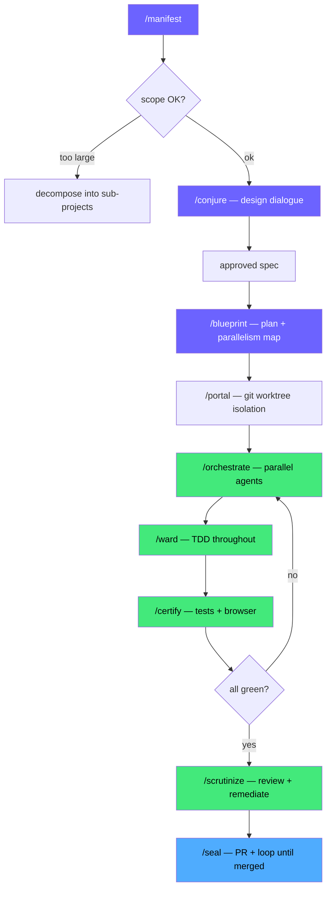
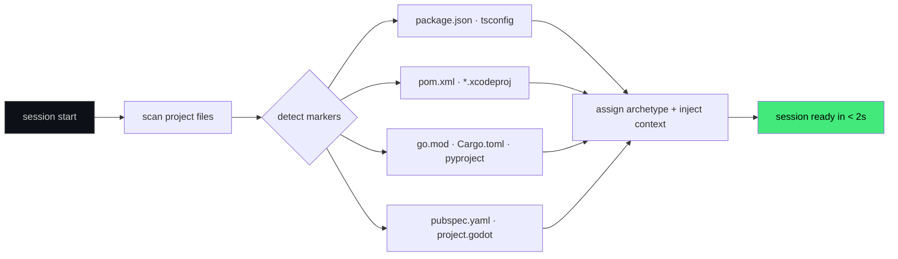
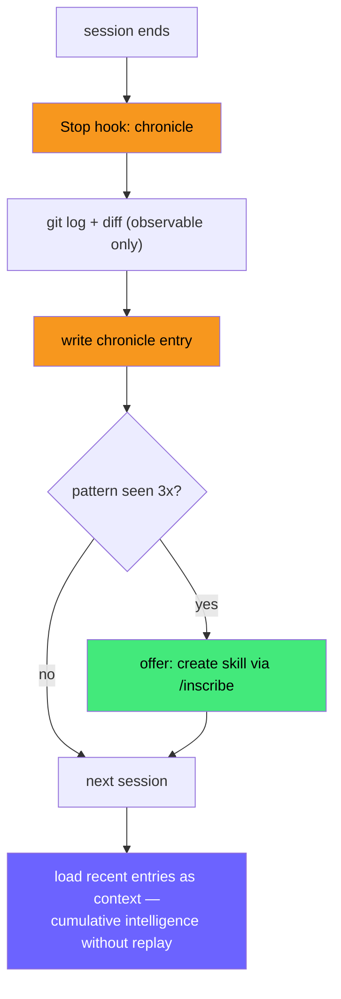

 

<h3>From idea to merged PR — autonomously, grounded in your code, gated only where it matters.</h3>

25 skills · a local code knowledge-graph · cross-session memory · parallel agent orchestration · an absolute destructive-command guard · zero required network calls or dependencies

## ✦ What it is

Most AI coding tools make **you** describe the stack, pick templates, and babysit context. **magician** inspects your project on every session start, assembles targeted knowledge for each technology it finds, grounds itself in a local graph of your code, and runs the whole software lifecycle — design → plan → build → verify → review → ship — pausing only at the decisions that are genuinely yours.

<table>
<tr>
<td width="50%" valign="top">
<h4>One command · idea → PR</h4>
<pre><code>/manifest</code></pre>
Gather requirements → design → TDD plan → parallel build → verify → review → PR. You approve the plan; it does the rest.
</td>
<td width="50%" valign="top">
<h4>Already exists? Transform it</h4>
<pre><code>/transmute</code></pre>
Comprehend a feature from its live usage, code, or docs — then <b>port</b> it elsewhere or <b>integrate / swap</b> it in place behind a parity contract.
</td>
</tr>
</table>

## ⚡ The flow

**Approve the plan once — then it executes autonomously**, re-gating only on real side effects (writes to shared state, commits, push, PRs, deploys). Reads, searches, tests, and knowledge-graph lookups never interrupt you.

<b>How it works — detailed diagrams</b> (manifest flow · dynamic inspector · self-learning)

 

### The manifest flow — full autonomous SDLC

Human gates (4 only): scope confirm → spec approval → plan approval → ship. Everything else: autonomous.

### Dynamic project inspector — no manual stack selection

Polyglot stacks (Next.js + FastAPI + Go) get full coverage automatically — no pack selection.

### Self-learning — intelligence grows each session

## 🧠 What makes it different

<table>
<tr>
<td width="50%" valign="top">
<h4>🤖 Real autonomy, not a prompt</h4>
Turns on Claude Code <b>auto mode</b> (<code>magician-ui automode</code>) — its classifier auto-approves reads and request-aligned work and <b>gates writes, deploys, force-push, and destructive ops</b>, honoring boundaries you state in chat. Approve the plan, then step back.
</td>
<td width="50%" valign="top">
<h4>🗺 Grounded in your code</h4>
A local <b>knowledge-graph</b> (<code>kg</code>, stdlib, no network) indexes your repo into ranked <code>file:line</code> retrieval + change <b>blast-radius</b> — so agents fetch exactly what they need instead of grepping whole files. Fewer tokens, shared across agents, zero context loss.
</td>
</tr>
<tr>
<td width="50%" valign="top">
<h4>🔒 An absolute safety floor</h4>
A <code>PreToolUse</code> hard gate blocks catastrophic commands <b>before permission rules even run</b> — it overrides allow-rules, fires in every mode, and has no escape hatch. <code>rm -rf /</code> never executes here.
</td>
<td width="50%" valign="top">
<h4>🧾 Evidence over claims</h4>
No "done / fixed / passing" without a verification command run <i>this turn</i> whose output was read — and a subagent's task is only done when the <b>VCS diff</b> shows it, not when the agent says "success."
</td>
</tr>
<tr>
<td width="50%" valign="top">
<h4>🧭 Remembers across sessions</h4>
Per-project <code>.workspace/</code> (team-shared via git) plus a machine-global reference store loaded into <b>every</b> session. Context follows you across repos; conventions survive context compaction.
</td>
<td width="50%" valign="top">
<h4>🔌 MCP-free integrations</h4>
Jira &amp; Confluence over their REST APIs via bundled CLIs — throttle-aware, bulk-safe, one command per call. No MCP server to run, no per-call prompts.
</td>
</tr>
</table>

## 🔒 Safety — an absolute destructive-command guard &nbsp;<code>new in 4.6.0</code>

> Security is infrastructure, not advice.

Claude Code keeps its existing `PreToolUse(Bash|PowerShell)` guard unchanged. Codex ships a separate POSIX `PreToolUse(Bash)` matcher tailored to Codex's event schema; trust it once via `/hooks` and keep Codex sandboxing + approvals enabled. Both are deterministic defense-in-depth layers, not replacements for the host sandbox.

The Codex adapter requires Python 3.10+ for its safety hook and bundled helpers.

<table>
<tr>
<td width="50%" valign="top">
<h4>🗑 Filesystem wipes</h4>
<code>rm -rf /</code> · <code>~</code> · <code>$HOME</code> · <code>--no-preserve-root</code> · system roots
</td>
<td width="50%" valign="top">
<h4>💽 Disk &amp; device destruction</h4>
<code>dd of=/dev/…</code> · <code>mkfs</code> · <code>wipefs</code> · <code>blkdiscard</code> · <code>shred /dev/…</code> · <code>diskutil erase…</code>
</td>
</tr>
<tr>
<td width="50%" valign="top">
<h4>⛓ Device / critical-file overwrite</h4>
redirection onto <code>/dev/sd*</code> · over <code>/etc/passwd</code> · <code>shadow</code> · <code>sudoers</code> · <code>fstab</code>
</td>
<td width="50%" valign="top">
<h4>💣 Fork bombs</h4>
<code>:(){ :|:&amp; };:</code> and self-replicating variants
</td>
</tr>
<tr>
<td width="50%" valign="top">
<h4>🔑 Recursive perms on system roots</h4>
<code>chmod -R</code> / <code>chown -R</code> on <code>/</code> · <code>~</code> · <code>/etc</code> · <code>/usr</code> …
</td>
<td width="50%" valign="top">
<h4>🕳 Opaque exec &amp; repo loss</h4>
download piped into a shell · <code>base64 -d</code> → shell · <code>eval "$(…)"</code> · <code>git clean -x</code>
</td>
</tr>
</table>

Wrappers and nested payloads are inspected (`sudo`/`env`/`timeout` prefixes and one level of `sh -c '…'` are unwrapped before matching) while quoted inert mentions remain allowed.

### What it guarantees — and what it does not

This is a **denylist, not a sandbox** ([CWE-78](https://cwe.mitre.org/data/definitions/78.html)). Be honest about the boundary:

**It guarantees** — once installed, and on Codex once trusted via `/hooks`:

- **Deterministic.** The listed catastrophic patterns are blocked by a fixed matcher, not by model judgment — same input, same block, every time.
- **Pre-execution.** The deny fires in `PreToolUse`, before the shell runs. In Claude Code it runs *before* permission/allow rules, so an over-broad allow-rule or auto-mode can't wave these through.
- **Wrapper-aware.** Common wrappers and one level of `sh -c` nesting are unwrapped before the pattern check.

**It does _not_ guarantee** — treat these as hard limits, not caveats:

- **Not a complete boundary.** It blocks known catastrophic *forms*. A novel obfuscation, an unlisted tool, or destruction through a language runtime (e.g. a Python script calling `os.remove`) can slip past. The real containment layer is the host sandbox — Claude Code's sandbox and Codex's `workspace-write` / `read-only`.
- **Shell-tool scoped.** It matches the Bash/PowerShell tool it is wired to. It does not inspect bytes sent to an already-running process (Codex `write_stdin`) or non-shell tools. The Codex launcher is POSIX-only.
- **Codex must trust it.** Enabling the plugin does not auto-run its hooks — untrusted, Codex skips the guard entirely. Requires Python 3.10+.

**Bottom line:** it is deterministic defense-in-depth that sits *under* the sandbox, approval policy, and model judgment — not a replacement for any of them. Keep the sandbox and approvals on.

## 🛠 Skills

<b>25 skills</b>, each with modern frontmatter (<code>allowed-tools</code> · <code>disable-model-invocation</code> · <code>argument-hint</code> · <code>context: fork</code>) that scales reasoning effort to the task. Approval gates use the structured <b>AskUserQuestion</b> tool, not prose.

<table>
<tr>
<td width="50%" valign="top">
<h4>⚙️ Core SDLC</h4>
<code>/manifest</code> · <code>/conjure</code> · <code>/blueprint</code> · <code>/ward</code> · <code>/unravel</code> · <code>/certify</code>
</td>
<td width="50%" valign="top">
<h4>🎛 Orchestration</h4>
<code>/orchestrate</code> · <code>/weave</code> · <code>/portal</code> · <code>/seal</code>
</td>
</tr>
<tr>
<td width="50%" valign="top">
<h4>🛡 Review &amp; security</h4>
<code>/scrutinize</code> · <code>/divine</code> · <code>/sentinel</code>
</td>
<td width="50%" valign="top">
<h4>🧠 Intelligence</h4>
<code>/knowledge-graph</code> · <code>/chronicle</code> · <code>/statusline</code>
</td>
</tr>
<tr>
<td width="50%" valign="top">
<h4>🔗 Integration</h4>
<code>/jira</code> · <code>/confluence</code>
</td>
<td width="50%" valign="top">
<h4>🔬 Research · Quality · Meta</h4>
<code>/magic</code> · <code>/transmute</code> · <code>/accelerate</code> · <code>/deploy</code> · <code>/autopsy</code> · <code>/almanac</code> · <code>/inscribe</code>
</td>
</tr>
</table>

<b>Full skill catalog</b> — what each one does

 

| Skill | Purpose |
|---|---|
| `/manifest` | Full autonomous SDLC — 4 human gates (scope · spec · plan · ship); runs conjure → blueprint → portal → orchestrate → certify → scrutinize → seal |
| `/conjure` | Structured design dialogue with a visual browser companion — 4 modes; HARD-GATE: no code until the spec is approved |
| `/blueprint` | Turns an approved spec into a TDD task plan with a parallelism map + a verbatim Global-Constraints header every task inherits |
| `/ward` | TDD engine — red → green → refactor, one behavior at a time; the RED test must fail for the reason under test |
| `/unravel` | Systematic debugging — hypothesis before evidence; read the trace fully, reproduce first, instrument boundaries; not done until the original symptom is gone |
| `/certify` | Full verification loop — tests · types · lint · build · browser check; evidence before any success claim |
| `/orchestrate` | Multi-agent build from a blueprint — parallel waves + a per-task two-stage review (spec then quality), confirmed from the VCS diff |
| `/weave` | Composes + runs a large multi-item delivery as one native Workflow with all guardrails (TDD per unit · kg grounding · certify · adversarial review) |
| `/scrutinize` | Three specialist reviewers in parallel (correctness · security · simplification), consolidated then remediated |
| `/divine` | Research-grounded code review — detects PR/MR/branch context, gates depth, 4 lenses, adversarially verifies findings, severity-ranked report |
| `/sentinel` | Security scan — OWASP Top 10, secret detection, injection surfaces, dependency + git-history audit (read-only, forked context) |
| `/knowledge-graph` | Local code knowledge-graph + cache (`kg` CLI, stdlib) — ranked `file:line` (BM25 + Personalized PageRank), neighbors, blast-radius |
| `/chronicle` | Memory &amp; context steward — session history, global reference store, live context size + a pre-compaction resume capsule |
| `/statusline` | Magician CLI UI — a local, zero-token status line (context % · rot warning · sparkline · model/git/cost · active skill · 🧠 effort) |
| `/jira` · `/confluence` | Atlassian over REST via bundled CLIs (no MCP) — read/search, create/update (write-gated), throttle-aware, first-run token setup |
| `/magic` | Research, analysis &amp; consulting — web + docs + local files; saves findings that feed conjure/blueprint/unravel |
| `/transmute` | Comprehend an existing feature → PORT or INTEGRATE it, behind a parity contract + quality gateways |
| `/accelerate` | Performance profiling — baseline-first, measure → optimize → re-measure |
| `/deploy` | CI/CD pipeline create/update/monitor (GitHub Actions · GitLab CI · CircleCI) with a background CI-red watcher |
| `/autopsy` | Blameless post-mortem — timeline · 5-Whys · action items |
| `/almanac` | One-time workspace init — `.workspace/`, lean `CLAUDE.md`, `.gitignore`, MCP suggestions |
| `/inscribe` | Author a new reusable skill; suggested by the pattern detector after repeated requests |
| `/portal` | Git worktree isolation for a feature, with post-merge cleanup |

## 🚀 Install

<table>
<tr>
<td width="50%" valign="top">
<h4>Claude Code</h4>
<pre><code>/plugin marketplace add https://github.com/Alexander-Tyagunov/magician
/plugin install magician@magician</code></pre>
Restart if prompted, then initialize your workspace with <code>/almanac</code>.
</td>
<td width="50%" valign="top">
<h4>Codex</h4>
<pre><code>codex plugin marketplace add Alexander-Tyagunov/magician
codex plugin add magician@magician</code></pre>
Restart or open a new task, then: <i>“Use $almanac to set up Magician in this workspace.”</i>
</td>
</tr>
</table>

Codex installs a self-contained package with adapters under <code>skills/</code>. Use <code>codex plugin list</code> to confirm it is installed and enabled; an enable flag alone does not install package contents.

## 🗂 Workspace — team memory

<table>
<tr>
<td width="58%" valign="top">
<pre><code>.workspace/
├── shared/         ← git-committed (whole team)
│   ├── specs/       design specs   (/conjure)
│   ├── plans/       impl plans      (/blueprint)
│   ├── research/    findings        (/magic)
│   ├── decisions/   ADRs
│   └── postmortems/ (/autopsy)
└── local/          ← always gitignored
    ├── prefs.md     personal prefs
    └── session.md   pre-compaction state</code></pre>
</td>
<td width="42%" valign="top">
Teammates share <code>shared/</code> via git; each machine keeps its own <code>local/</code>. A machine-global reference store loads into every session, so context follows you across repos.
  
Subagents never inherit your conversation — every handoff ships a <b>self-contained context contract</b> (goal · scope · inputs-by-path · constraints · return format), so nothing is lost across agents, workflows, or teams.
</td>
</tr>
</table>

## 🧰 Bundled CLIs &nbsp;(on <code>PATH</code> when the plugin is enabled)

<table>
<tr>
<td width="50%" valign="top">
<h4><code>kg</code></h4>
Local code knowledge-graph + cache — <code>kg init</code> → <code>kg query "&lt;topic&gt;"</code> / <code>kg blast &lt;file&gt;</code>. Stdlib, no network.
</td>
<td width="50%" valign="top">
<h4><code>jira</code> · <code>confluence</code></h4>
MCP-free Atlassian REST clients — throttle-aware, bulk-safe, one command per call.
</td>
</tr>
<tr>
<td width="50%" valign="top">
<h4><code>magician-ui</code></h4>
Manage the CLI UI status line + <code>allow</code> (read-only auto-approve) + <code>automode</code> (auto mode) — safe, backed-up <code>settings.json</code> edits.
</td>
<td width="50%" valign="top">
<h4><code>magician-scan</code> · <code>ctx</code></h4>
Standalone security scan for CI · self-managed context (size tracking + pre-compaction resume capsule).
</td>
</tr>
</table>

### ❤ Support this work

If magician saves you time, consider sponsoring — it funds new skills, broader framework lore, and community support.

**[❤ Sponsor on GitHub →](https://github.com/sponsors/Alexander-Tyagunov)**

 

MIT © <a href="https://github.com/Alexander-Tyagunov">Alexander Tyagunov</a> · built for Claude Code &amp; Codex

