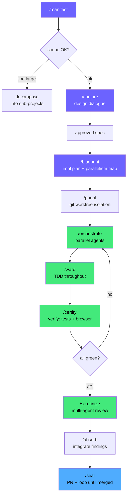
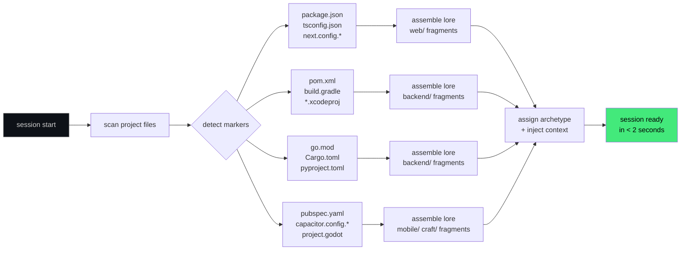
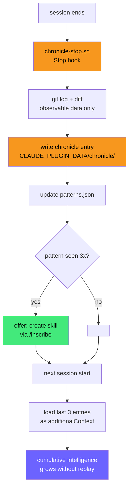

<div align="center">

```
         *        
        /|\       
       / | \      
      /  *  \     
     /_________\  
    /\  o    o  /\  ---- * . * . * .
   /    =======   \    . * . * . * .
  /    ( ~~~~~ )   \  * . * . * . *
  \________________/
     |   | |   |  
```

# magician

**Full-stack SDLC plugin for Claude Code**

Inspects your project, assembles the right knowledge automatically, orchestrates parallel agents, learns from every session, and ships clean code — from idea to merged PR, autonomously.

[](https://github.com/Alexander-Tyagunov/magician/releases)
[](LICENSE)
[](https://github.com/sponsors/Alexander-Tyagunov)

</div>

---

## What it does

Most AI coding tools require you to describe your stack, pick templates, and manage context manually. Magician inspects your project on every session start, assembles targeted knowledge for every technology it finds, and gets smarter with every session.

One command to go from idea to PR:

```
/manifest
```

---

## How it works

### The manifest flow — full autonomous SDLC



Human gates (4 only): scope confirm → spec approval → plan approval → PR title. Everything else: autonomous.

---

### Dynamic project inspector — no manual stack selection



Polyglot stacks (Next.js + FastAPI + Go) get full coverage automatically. No pack selection needed.

---

### Self-learning — intelligence grows each session



---

## Skills

| Skill | Purpose | Category |
|---|---|---|
| `/conjure` | Design dialogue — spec before any code | Core SDLC |
| `/blueprint` | Implementation plan with parallelism map | Core SDLC |
| `/forge` | Execute one task from a blueprint | Core SDLC |
| `/ward` | TDD — failing test first, always | Core SDLC |
| `/unravel` | Systematic debugging with hypothesis preflight | Core SDLC |
| `/certify` | Verification loop — tests, types, linter, browser | Core SDLC |
| `/summon` | Spawn parallel subagents with skill context | Orchestration |
| `/orchestrate` | Multi-agent SDLC execution from blueprint | Orchestration |
| `/scrutinize` | Request multi-agent code review | Orchestration |
| `/absorb` | Integrate review findings by severity | Orchestration |
| `/portal` | Git worktree isolation for feature work | Orchestration |
| `/seal` | Simplify → commit → PR → loop until merged | Orchestration |
| `/almanac` | Initialize workspace, generate lean CLAUDE.md | Workspace |
| `/chronicle` | View and manage session learnings | Intelligence |
| `/sentinel` | Security scan — OWASP, credentials, injection | Security |
| `/accelerate` | Performance profiling with baseline measurement | Quality |
| `/deploy` | CI/CD pipeline management | Quality |
| `/inscribe` | Write a new reusable skill | Meta |
| `/manifest` | Full autonomous SDLC — idea to merged PR | Full flow |
| `/autopsy` | Post-mortem / incident analysis | Quality |

---

## Installation

### Add the marketplace and install

```bash
/plugin marketplace add https://github.com/Alexander-Tyagunov/magician
/plugin install magician@magician-marketplace
```

### Or install directly

```bash
/plugin install github:Alexander-Tyagunov/magician
```

### After install — initialize your workspace

```
/almanac
```

This detects your stack, creates `.workspace/`, generates a lean `CLAUDE.md`, and suggests relevant MCPs.

---

## Workspace — team memory

```
.workspace/
├── shared/           ← git committed (team sees this)
│   ├── context.md    team state, open decisions
│   ├── roadmap.md    cross-session priorities
│   ├── decisions/    architecture decision records
│   ├── specs/        design specs from /conjure
│   └── postmortems/  /autopsy outputs
└── local/            ← always gitignored (your machine only)
    ├── prefs.md      personal preferences
    └── session.md    last session state (saved before compaction)
```

Multiple developers on the same repo share `.workspace/shared/` via git. Each machine keeps its own `.workspace/local/`. Context flows automatically — no manual sync.

---

## Security

Security is infrastructure, not advice.

- **Hard deny rules** in `settings.json` — blocks pipe-to-shell, eval, credential file access before any prompt sees them
- **PreToolUse hook** — `sentinel-guard.sh` scans every Bash command for injection patterns and lethal trifecta (private data + network + execution)
- **`magician-scan`** — standalone CLI for CI pipelines: `./bin/magician-scan .`
- **Workspace isolation** — `.workspace/local/` is always gitignored; per-machine secrets never reach git

---

## Support this work

If magician saves you time, consider sponsoring its development.

**[❤ Sponsor on GitHub →](https://github.com/sponsors/Alexander-Tyagunov)**

Sponsorship funds continued development: new skills, lore coverage for additional frameworks, Windows compatibility improvements, and community support.

---

## License

MIT © [Alexander Tyagunov](https://github.com/Alexander-Tyagunov)
